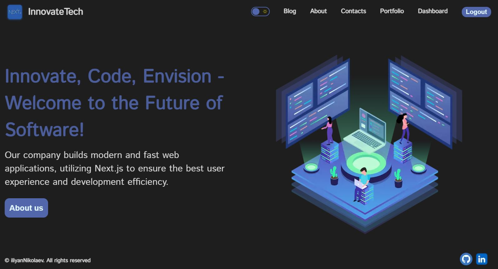
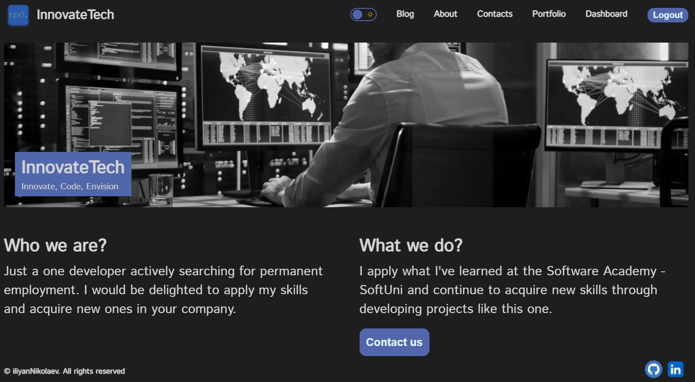
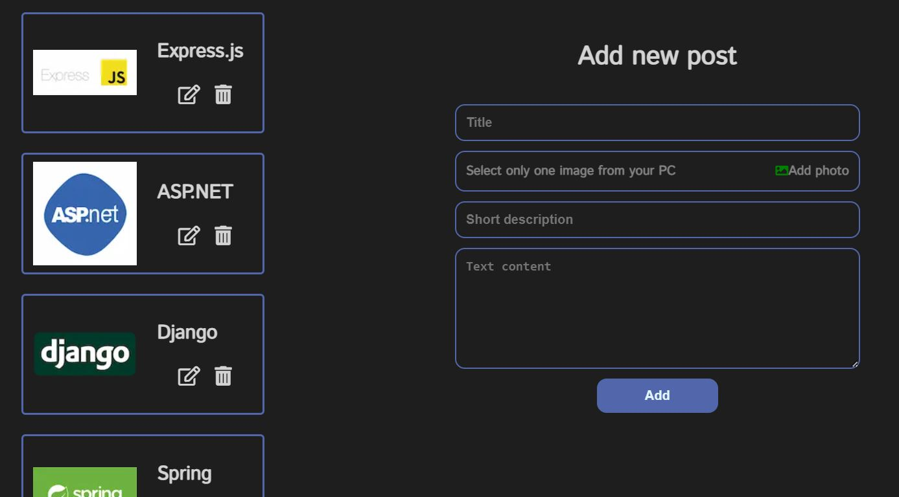
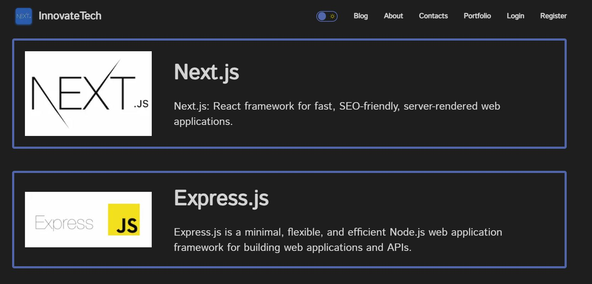
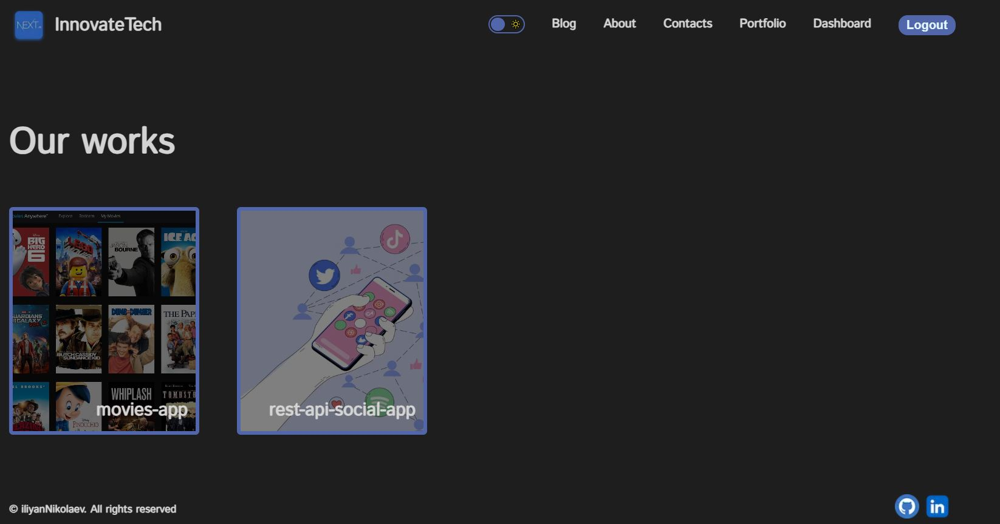

# Company blog built with Next.js
* Author - Iliyan Nikolaev M.
* Release date - Q4'23
* Live Demo: [view demo](https://nextjs-blog-app-smoky-six.vercel.app)
* You can log in with: username: "ilich" / password: "123"

### Introduction

This is an example blog for a company where employees can register and upload posts that unregistered users can view. The project implements the four basic CRUD operations. Please review the demo.

### Used technologies
* Framework - [Next.js](https://nextjs.org/)
* Authentication - [NextAuth.js](https://next-auth.js.org/)
* Cloud store for pictures - [Cloudinary](https://cloudinary.com/)
* Database - MongoDB / cloud - [MongoDB Atlas](https://www.mongodb.com/atlas/database) 
* ODM - [Mongoose](https://mongoosejs.com/)
* Deploy - [Vercel](https://vercel.com/)

### Screenshots

